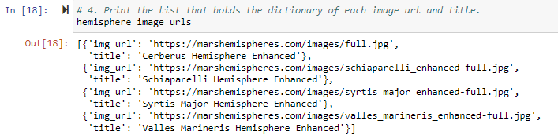
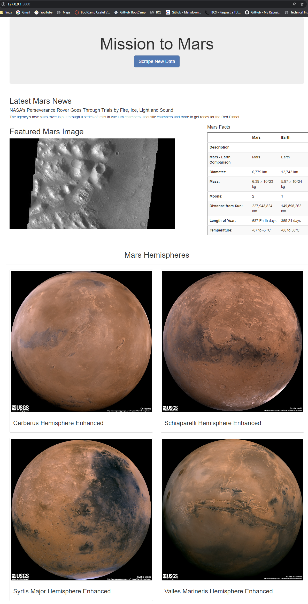

# Mission-to-Mars

## Overview

The main objective of this module (**Module 10: Mission to Mars - Web Scraping with HTML/CSS**) is to use *BeautifulSoup* and *Splinter* to scrape information and images from the NASA about the planet Mars. *Mongo* is used to store the scraped information in a database. *Flask* is used to create a webpage to showcase our results while *Bootstrap* components are included to customize our site.

## Resources

### Sources used for scraping the information:

* Latest news articles are scraped from the NASA Mars news webpage:   *https://redplanetscience.com*
* HImages from the Jet Propulsion Laboratory's Space webpage:         *https://spaceimages-mars.com*
* Full-resolution images of Mars’s hemispheres:                       *https://marshemispheres.com*

### List of Applications:

* *Jupyter Notebook v6.4.8*
* *Python v3.10*
* *Pandas v1.5*
* *Flask v2.2x*
* *Mongodb Community Server v5.0.13*
* *html5lib and lxml*
* *ChromeDriver*
* *Splinter splinter 0.18.1*
* *Beautiful Soup 4.9.0*

### Input Datasets

* **[Starter Code](https://2u-data-curriculum-team.s3.amazonaws.com/dataviz-online/module_10/Mission_to_Mars_Challenge_starter_code.ipynb)**.
* **[html](https://2u-data-curriculum-team.s3.amazonaws.com/dataviz-online/module_10/index.html)**

## Results

### Requested Deliverables:

The following is the list of the requested deliverables for this challenge:

1. **Deliverable 1:** Scrape Full-Resolution Mars Hemisphere Images and Titles
2. **Deliverable 2:** Update the Web App with Mars Hemisphere Images and Titles
3. **Deliverable 3:** Add Bootstrap 3 Components

### Provided Deliverables:

The following is the list of the provided deliverables and results obtained in this challenge:

1. **[Deliverable 1: Mission_to_Mars.ipynb](Mission_to_Mars.ipynb)**. Jupyter Notebook with the Python code to extract the latest Mars news, JPL space featured images, Mars facts table and the high-resolution Mars' hemisphere images and titles.
2. **[Deliverable 2: scraping.py](./scraping.py)**. Python3 file derived from the deliverable 1, with functions defined to scrape information from the web about Mars.
3. **[Deliverable 2: app.py](./app.py)** Configuration file needed to run Flask.
4. **[Deliverable 3: index_raw.html](./templates/index_raw.html)**. HTML template file needed to display our webpage with the scraped information.
5. **[Deliverable 3: index.html](./templates/index.html)**. HTML template with additional Bootstrap components to customize the webpage.

### Images

The following is a list of images that support our code:

*Image 01: Deliverable 1 - Output dictionary.*

*Image 02: Deliverable 2 - Mongo Dabatase.*

*Image 03: Deliverable 2 - WebApp.*

*Image 04: Deliverable 3 - WebApp Responsive for Microfost Surface Pro 7.*

*Image 05: Deliverable 3 - WebApp before customization.*

*Image 06: Deliverable 3 - WebApp after Bootstrap components added for customization.*